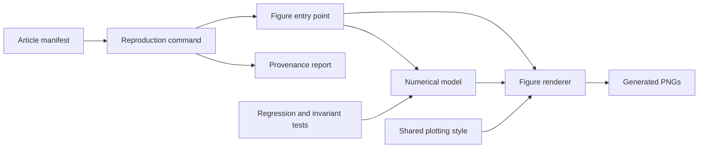

# Architecture

The repository keeps the computation behind an article separate from publication.
The website owns prose, URLs, layouts, and production images. This project owns
models, simulations, rendering, and tests of numerical claims.

## Package boundaries

`src/blog_reproducibility/` is the installed, typed Python package. Domain modules
contain article-specific calculations. Numerical models use explicit parameters
and local random generators, and can be imported without rendering a plot.
Renderer modules combine models with the shared `common` plotting utilities.
`house.mplstyle` and `py.typed` ship in both the wheel and source distribution.

`scripts/figures/` contains command-line adapters. They print JSON calculation
payloads, accept `--output-dir`, and support `--dry-run`. Repository orchestration
lives in `scripts/reproduce.py`; metadata validation lives in `scripts/manifest.py`.
These tools use development dependencies and are included in the source archive.

`articles/manifest.yml` links website paths to local source and tests. JSON Schema
validates its structure; additional checks verify file existence, directory
boundaries, and output uniqueness. Website paths are metadata and are not checked
against a network service during testing.

## Verification layers

1. Model tests verify quoted values, independent calculations, and invariants.
2. Renderer and command tests verify usable PNGs and JSON calculation payloads.
3. Manifest tests prevent broken mappings and conflicting output names.
4. Reproduction tests verify report hashes and failure behavior.
5. CI checks distribution contents against the checkout, including all package
   files and the source archive's reproduction inputs. It then renders smoke-test
   figures from a clean wheel installation and every registered figure from the
   checkout.

The project is an article reproducibility collection. Shared abstractions should
be introduced when multiple examples need them; domain-specific models remain
close to the claims they support.
